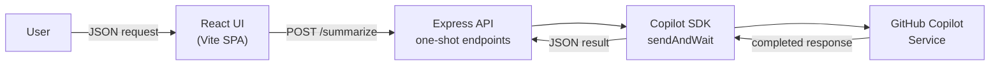
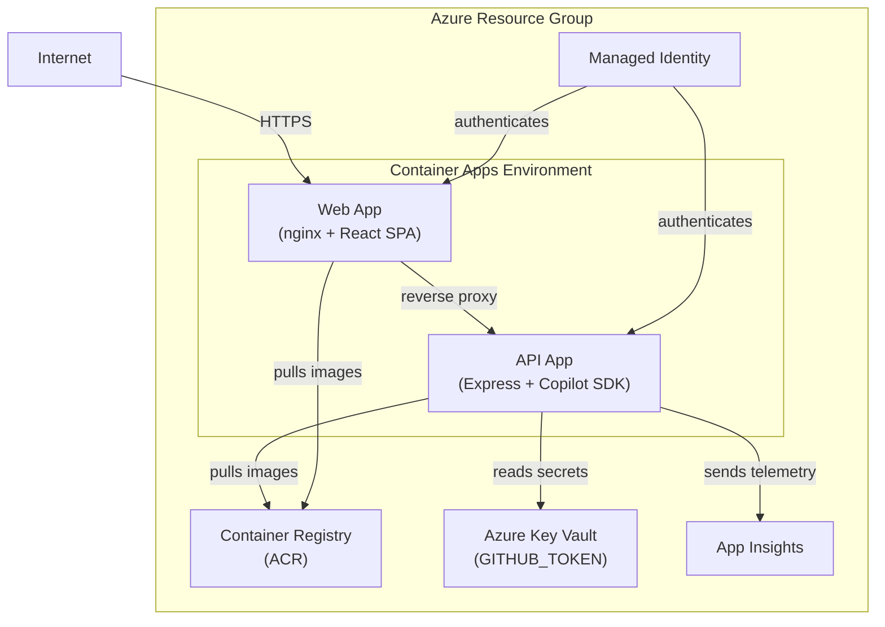

# Copilot SDK Service

A starter template for building AI-powered API services with the [GitHub Copilot SDK](https://github.com/github/copilot-sdk) deployed to [Azure Container Apps](https://learn.microsoft.com/azure/container-apps/).

## Overview

Copilot SDK Service is a full-stack TypeScript application that demonstrates how to build **one-shot AI endpoints** using the GitHub Copilot SDK. Unlike the [agent template](https://github.com/jongio/copilot-sdk-agent) (multi-turn SSE streaming chat), this template is for request/response AI tasks — summarize, classify, extract, rate — with a test UI for sending requests and viewing JSON results.

- **Backend** (`src/api/`) — Express server that creates a Copilot SDK session, sends a prompt, and returns the completed result as JSON.
- **Frontend** (`src/web/`) — React + Vite single-page app for testing endpoints, with dark/light mode and Markdown rendering.

## Features

- **One-shot AI endpoints** — Request/response pattern using the Copilot SDK's `sendAndWait()`
- **React test UI** — Modern chat-style interface with dark/light mode and Markdown/code rendering
- **One-command local dev** — Run all services with `azd app run` via [`azd app`](https://github.com/jongio/azd-app)
- **One-command Azure deployment** — Deploy to Azure Container Apps with `azd up`
- **Docker-based containerization** — Multi-stage Dockerfiles for optimized production builds
- **Automatic GitHub token provisioning** — Preprovision hook retrieves your token via `gh` CLI

## How It Works (Copilot SDK)

This template uses the GitHub Copilot SDK's **one-shot** pattern. Each API request creates a session, sends a single prompt, and waits for the complete response — no streaming, no multi-turn conversation.

```typescript
import { CopilotClient } from "@github/copilot-sdk";

// 1. Create a client with your GitHub token
const client = new CopilotClient({ githubToken: process.env.GITHUB_TOKEN });

// 2. Create a session with a model
const session = await client.createSession({ model: "gpt-4o" });

// 3. Send a prompt and wait for the complete response
const result = await session.sendAndWait({
  prompt: `Summarize the following text:\n\n${text}`,
});

// 4. Return the result as JSON
res.json({ summary: result?.data?.content });
```

This differs from the [agent template](https://github.com/jongio/copilot-sdk-agent), which uses `createSession()` with tools and streams tokens via SSE for interactive chat. The service template is ideal for backend AI tasks that don't need real-time streaming.

## Prerequisites

| Tool | Version | Purpose |
|------|---------|---------|
| [pnpm](https://pnpm.io/) | 10+ | Fast, disk-efficient package manager |
| [Node.js](https://nodejs.org/) | 24+ | Runtime for the API and build tooling |
| [GitHub CLI (`gh`)](https://cli.github.com/) | Latest | Provides the `GITHUB_TOKEN` for the Copilot SDK |
| [Azure Developer CLI (`azd`)](https://learn.microsoft.com/azure/developer/azure-developer-cli/install-azd) | Latest | Provisions and deploys Azure resources |
| [Docker](https://docs.docker.com/get-docker/) | Latest | *(Optional)* Local container testing |

**GitHub CLI setup:**

```bash
gh auth login
gh auth refresh --scopes copilot
```

## Quick Start

### 1. Install [Azure Developer CLI (`azd`)](https://learn.microsoft.com/azure/developer/azure-developer-cli/install-azd)

### 2. Install the [`azd app`](https://github.com/jongio/azd-app) extension

```bash
azd extension source add -n jongio -t url -l https://jongio.github.io/azd-extensions/registry.json
azd extension install jongio.azd.app
```

### 3. Init and run

```bash
azd init -t jongio/copilot-sdk-service
azd app run
```

The `prerun` hook automatically retrieves your `GITHUB_TOKEN` from the `gh` CLI via `scripts/get-github-token.mjs` (the same script also runs as a `preprovision` hook during `azd up`). `azd app` installs dependencies, starts both services, and provides a real-time dashboard. Open the URL shown in the dashboard output to start testing.

<details>
<summary><b>Run services manually (without azd app)</b></summary>

```bash
# Set your GitHub token
export GITHUB_TOKEN=$(gh auth token)

# Install dependencies
cd src/api && pnpm install && cd ../web && pnpm install && cd ../..

# Start the API server (in one terminal)
cd src/api && pnpm dev

# Start the web dev server (in another terminal)
cd src/web && pnpm dev
```

</details>

## Project Structure

```
copilot-sdk-service/
├── src/
│   ├── api/                    # Express backend
│   │   ├── index.ts            # App entry point — Express setup, CORS, route registration
│   │   ├── routes/
│   │   │   ├── summarize.ts    # POST /summarize — Copilot SDK one-shot AI processing
│   │   │   └── health.ts       # GET /health — Health check endpoint
│   │   ├── Dockerfile          # API container (Node.js + pnpm, non-root user)
│   │   ├── package.json        # API dependencies
│   │   └── tsconfig.json       # TypeScript config (server)
│   └── web/                    # React frontend
│       ├── App.tsx             # Root component
│       ├── App.css             # App styles with dark/light mode
│       ├── main.tsx            # React entry point
│       ├── index.html          # HTML shell
│       ├── index.css           # Global styles & CSS custom properties
│       ├── types.ts            # Shared TypeScript types
│       ├── components/
│       │   ├── ChatWindow.tsx  # Message display with Markdown rendering
│       │   ├── MessageInput.tsx# Input field with submit handling
│       │   └── ThemeToggle.tsx # Dark/light mode toggle
│       ├── hooks/
│       │   ├── useService.ts   # Service request state management
│       │   └── useTheme.ts     # Theme preference with localStorage
│       ├── nginx.conf.template # Nginx config — reverse proxy to API
│       ├── Dockerfile          # Web container (Vite build + nginx)
│       ├── package.json        # Web dependencies
│       └── vite.config.ts      # Vite configuration
├── infra/                      # Azure infrastructure (Bicep)
│   ├── main.bicep              # Subscription-scoped deployment
│   ├── main.parameters.json    # Parameter mappings for azd
│   └── resources.bicep         # All Azure resources (ACR, Container Apps, Key Vault, etc.)
├── scripts/                    # Automation scripts
│   └── get-github-token.mjs    # Hook: injects GITHUB_TOKEN from gh CLI (runs on prerun and preprovision)
├── azure.yaml                  # Azure Developer CLI service definition
└── README.md
```

## Adding Endpoints

Endpoints are Express routes that use the Copilot SDK for one-shot AI processing. To add a new endpoint:

**1. Create a route file in `src/api/routes/`:**

```typescript
// src/api/routes/classify.ts
import { Router } from "express";
import { CopilotClient } from "@github/copilot-sdk";

const router = Router();

router.post("/classify", async (req, res) => {
  const client = new CopilotClient({ githubToken: process.env.GITHUB_TOKEN });
  const session = await client.createSession({ model: "gpt-4o" });
  const result = await session.sendAndWait({
    prompt: `Classify the following text into a category:\n\n${req.body.text}`,
  });
  res.json({ category: result?.data?.content });
});

export default router;
```

**2. Register the route in `src/api/index.ts`:**

```typescript
import classifyRoutes from "./routes/classify.js";

app.use(classifyRoutes);
```

**3. Add a proxy rule in `src/web/nginx.conf.template`** (for production):

```nginx
location /classify {
    proxy_pass ${API_URL}/classify;
    proxy_http_version 1.1;
    proxy_set_header Host $proxy_host;
}
```

## Deploy to Azure

```bash
azd up
```

This single command handles the entire deployment pipeline:

1. **Preprovision hook** — Retrieves your `GITHUB_TOKEN` from the `gh` CLI and stores it in the `azd` environment
2. **Provisions infrastructure** — Creates Azure Container Registry, Container Apps Environment, Key Vault, Application Insights, and a managed identity (using [Azure Verified Modules](https://azure.github.io/Azure-Verified-Modules/))
3. **Builds and pushes** — Builds the Docker images and pushes them to the provisioned ACR
4. **Deploys** — Deploys both containers to Azure Container Apps with the `GITHUB_TOKEN` securely referenced from Key Vault

To initialize from the template without cloning:

```bash
azd init --template jongio/copilot-sdk-service
azd up
```

## Development

The easiest way to run locally is with [`azd app`](https://github.com/jongio/azd-app), which starts all services, installs dependencies, and provides a real-time dashboard:

```bash
azd app run
```

You can also run services individually:

| Command | Directory | Description |
|---------|-----------|-------------|
| `azd app run` | repo root | Start all services with auto-dependency install and dashboard |
| `pnpm dev` | `src/api` | Start the Express server with hot reload (via `tsx --watch`) |
| `pnpm dev` | `src/web` | Start the Vite dev server with HMR for the React frontend |
| `pnpm build` | `src/api` | Compile the Express server |
| `pnpm build` | `src/web` | Bundle the React frontend |

## Architecture



**Azure deployment topology:**



The Web container app is **external** (internet-facing) and serves the React SPA via nginx, which reverse-proxies API requests to the internal API container app. The API container app is **internal** (no public endpoint) and communicates with the GitHub Copilot service using a `GITHUB_TOKEN` stored securely in Azure Key Vault.

## License

MIT
